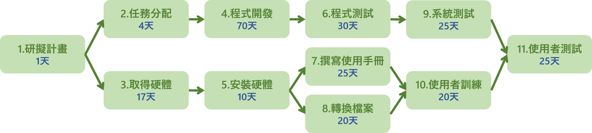
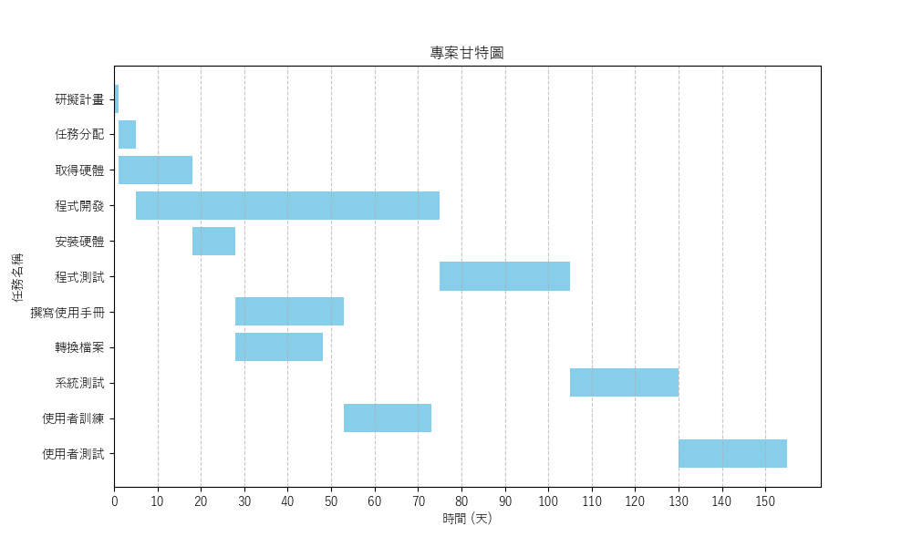

### CPM

### 甘特圖

### 關鍵路徑
1.研擬計畫 > 2.任務分配 > 4.程式開發 > 6.程式測試 > 9.系統測試 > 11.使用者測試
### 任務模式
| 任務 |      說明      | 需時(天) | 前置任務 | 開始時間 | 結束時間 |         任務模式         |
|:----:|:--------------:|:--------:|:--------:|:--------:|:--------:|:------------------------:|
|  1   |    研擬計畫    |    1     |    -     |    0     |    1     |        多重後續         |
|  2   |    任務分配    |    4     |    1     |    1     |    5     |          依存          |
|  3   |    取得硬體    |   17     |    1     |    1     |   18     |          依存          |
|  4   |    程式開發    |   70     |    2     |    5     |   75     |          依存          |
|  5   |    安裝硬體    |   10     |    3     |   18     |   28     |    依存、多重後續     |
|  6   |    程式測試    |   30     |    4     |   75     |  105     |          依存          |
|  7   | 撰寫使用手冊   |   25     |    5     |   28     |   53     |          依存          |
|  8   |   轉換檔案     |   20     |    5     |   28     |   48     |          依存          |
|  9   |    系統測試    |   25     |    6     |  105     |  130     |          依存          |
| 10   |  使用者訓練    |   20     |   7, 8    |   53     |   73     |   依存、多重前置     |
| 11   |  使用者測試    |   25     |   9, 10   |  130     |  155     |   依存、多重前置     |

